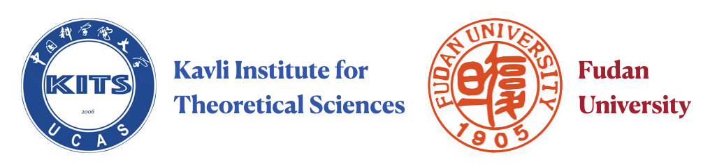

The 13th international workshop on Spin Caloritronics will be held in Beijing in May 20-24, 2024. Spin Caloritronics XIII will be co-organized by [Kavli Institute for Theoretical Sciences](https://kits.ucas.ac.cn/) (UCAS) and [Fudan University](https://www.fudan.edu.cn).

# Scope

Spin caloritronics is the science and technology of coupled spin, charge, and heat transport in condensed matter and devices, a multidisciplinary discipline that emerged from common interests in spintronics and thermoelectrics and that overlaps with other fields such as optics, mechanics, and information science.

The Spin Caloritornics workshops had been previously held in Leiden (2009, 2011), Sendai (2010, 2012), Columbus (2013, 2018), Irsee (2014), Utrecht (2016), Regensburg (2017), Groningen (2019), Urbana-Champaign (2022), Tsukuba (2023).	

# Organizers

* Prof. Jiang XIAO (Chair), Fudan University 
* Prof. Gerrit E. W. BAUER, KITS-UCAS and Tohoku University
* Prof. Wanjun JIANG, Tsinghua Unviersity

# Scientific Advisory Board

* Axel Hoffmann, UIUC, USA
* Burkard Hillebrands, TU Kaiserslautern, Germany
* Fuchun Zhang, KITS, China
* Joe Barker, University of Leeds, UK
* Kenichi Uchida, NIMS, Japan
* Sadamichi Maekawa, RIKEN, Japan
* Xiufeng Han, IoP, China
  
# Invited Speakers

* TBA

# Program

|           | May 20-Mon | May 21-Tue | May 22-Wed | May 23-Thu | May 24-Fri |  
|:---------:|:----------:|:------------:|:------------:|:------------:|:------------:|
| 9:00- 9:30|              |              |              |              |              |
| 9:30-10:00|              |              |              |              |              |
|10:00-10:30|_Coffee break_|_Coffee break_|_Coffee break_|_Coffee break_|_Coffee break_|
|10:30-11:00|              |              |              |              |              |
|11:00-11:30|              |              |              |              |              |
|11:30-12:00|              |              |              |              |              |
|12:00-14:00|_Lunch break_ |_Lunch break_ |_Lunch break_ |_Lunch break_ |_Lunch break_ |
|14:00-14:30|              |              |              |              |              |
|14:30-15:00|              |              |              |              |              |
|15:00-15:30|_Coffee break_|_Coffee break_|_Coffee break_|_Coffee break_|_Coffee break_|
|15:30-16:00|              |              |              |              |              |
|16:00-16:30|              |              |              |              |              |
|16:30-17:00|              |              |              |              |              |

# Application & Registration

* Please fill out this form to apply for the workshop before this date.
* The accepted applicants will be notified by email before this date.
* For invited speakers and accepted attendees, please fill this form for online registration before this date.

# Venue & Hotel

* Workshop Venue: Meeting room at UCAS campus
* Recommended Hotel: [Park Plaza Beijing Science Park](https://tinyurl.com/4e8rv3xf) / 北京丽亭华苑酒店

# Visa

For visa issue, please contact workshop secretary Mr. Peimin Yan (yanpeiming@ucas.ac.cn).

# Sponsors

